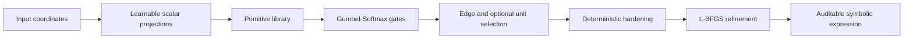

<p align="center">
  
</p>

<p align="center">
  <a href="https://github.com/jiangnan030-del/symbolic-kan-reproducible/actions/workflows/ci.yml"></a>
  
  <a href="LICENSE"></a>
  
  <a href="https://github.com/jiangnan030-del/symbolic-kan-reproducible/stargazers"></a>
  <a href="https://github.com/jiangnan030-del/symbolic-kan-reproducible/network/members"></a>
  <a href="https://github.com/sfaroughi3/Pub_Symbolic_KANs"></a>
</p>

<p align="center">
  <a href="#installation">Installation</a> ·
  <a href="#quick-start">Quick start</a> ·
  <a href="#architecture">Architecture</a> ·
  <a href="#reproducibility-status">Status</a> ·
  <a href="README.zh-CN.md">简体中文</a>
</p>

> **Unofficial derivative — attribution required.** This repository packages and refactors
> the public Symbolic-KAN research code. The Symbolic-KAN method, paper, and original
> experiments belong to Salah A. Faroughi, Farinaz Mostajeran, Amirhossein Arzani, and
> Shirko Faroughi. This project is not an official release and is not endorsed by them.

A research-oriented Python package for inspecting, testing, and extending Symbolic
Kolmogorov–Arnold Networks with discrete primitive, edge, and optional unit selection.
The first alpha release prioritizes provenance, deterministic evaluation, testability,
and a clean API over claiming complete reproduction of the paper.

## Upstream attribution

- Paper: **“Symbolic–KAN: Kolmogorov-Arnold networks with discrete symbolic structure
  for interpretable learning”**
- Authors: Salah A. Faroughi, Farinaz Mostajeran, Amirhossein Arzani, Shirko Faroughi
- Original code: https://github.com/sfaroughi3/Pub_Symbolic_KANs
- Audited upstream commit: [`9481a82`](https://github.com/sfaroughi3/Pub_Symbolic_KANs/commit/9481a822e73e5a7520c6c0a425a8a402f2878c03)
- License: MIT notice embedded in the upstream Python files

Read [`NOTICE.md`](NOTICE.md) before redistributing or publishing results. In scholarly
work, cite the original paper and repository as the source of the method. Cite this
package only as the derivative implementation used for your experiment.

## What this package changes

- Uses a standard `src/symbolic_kan` Python package instead of duplicated experiment code.
- Keeps stochastic Gumbel-Softmax for training but makes evaluation deterministic.
- Applies the configured AdamW weight decay to normal parameters explicitly.
- Implements the paper-style pairwise edge-overlap penalty as true NMS and keeps the
  upstream off-mass regularizer under a separate name.
- Supports both paper-aligned `fixed_sum` and upstream-compatible `trainable_linear`
  readouts.
- Hardens primitive, edge, and optional unit decisions before deterministic refinement.
- Provides a safe inverse primitive at zero.
- Implements variable-limit Gauss–Legendre Volterra quadrature using mapped nodes for
  every upper limit, with O(NQ) storage rather than an O(Q²) masked global rule.
- Records `legacy`, `paper`, `corrected`, and `smoke` profiles separately.

See [`docs/PAPER_CODE_DIFFERENCES.md`](docs/PAPER_CODE_DIFFERENCES.md) for the audited
differences and the boundary between upstream behavior and this derivative package.

## At a glance

| Area | Audited upstream code | This package |
| --- | --- | --- |
| Distribution | Experiment directories | Installable `src/` package |
| Evaluation | Stochastic Gumbel sampling | Deterministic soft/argmax evaluation |
| Edge regularization | Off-mass term labelled NMS | Pairwise NMS plus separate off-mass |
| Readout | Trainable linear layer | `fixed_sum` and `trainable_linear` |
| Experiment intent | Script-local settings | Explicit `legacy` / `paper` / `corrected` / `smoke` profiles |
| Volterra quadrature | Masked global rule | Variable-limit mapped Gauss–Legendre rule |
| Verification | Manual experiment scripts | Unit tests, CI, manifests, and provenance docs |

The table describes implementation differences; it does **not** claim that corrected
settings reproduce the paper's reported metrics.

## Architecture



Training explores discrete choices through Gumbel-Softmax. Evaluation is deterministic;
selected structures are hardened before continuous-parameter refinement and expression
export.

## Installation

Python 3.10–3.12 is supported.

```bash
# From GitHub
pip install "symbolic-kan-reproducible @ git+https://github.com/jiangnan030-del/symbolic-kan-reproducible.git"

# Editable development install
python -m venv .venv
source .venv/bin/activate
pip install -e ".[dev,viz]"
```

The distribution name is `symbolic-kan-reproducible`; the import package is
`symbolic_kan`.

## Quick start

```python
import torch
from symbolic_kan import ModelConfig, SymbolicKAN, export_expression

config = ModelConfig(
    input_dim=1,
    hidden_units=4,
    edges_per_unit=2,
    num_blocks=2,
    primitives=("x", "x2", "sin", "cos", "exp"),
    readout="fixed_sum",
)

model = SymbolicKAN(config)
x = torch.linspace(-1, 1, 64).reshape(-1, 1)

model.eval()                 # deterministic soft evaluation
prediction = model(x)
model.harden()               # deterministic discrete structure
print(export_expression(model, variables=["x"]))
```

Command-line smoke test:

```bash
symkan info
symkan smoke --config experiments/reaction_diffusion/configs/smoke.yaml
```

A small supervised demonstration is available through:

```bash
symkan fit-demo \
  --config experiments/regression/configs/smoke.yaml \
  --output outputs/regression-smoke
```

## Configuration profiles

- `legacy`: documents the behavior observed in the audited upstream script.
- `paper`: follows settings stated in the manuscript where they differ from uploaded code.
- `corrected`: enables the package's numerical and reproducibility fixes.
- `smoke`: tiny configuration for CI and installation checks; not a scientific benchmark.

The profiles are intentionally separate. A result from `corrected` is not an upstream
paper result, and a passing `smoke` run is not a paper reproduction.

## Package layout

```text
src/symbolic_kan/          core model, gates, training, export and problem helpers
experiments/               named YAML configurations; no hidden defaults
examples/                  minimal API examples
tests/                     unit and scientific-regression tests
docs/                      provenance, differences and reproducibility guidance
```

## Reproducibility status

This is an **alpha research package**. It includes tests for deterministic evaluation,
hardening, primitive safety, true NMS, expression export, optimizer configuration, and
Volterra quadrature. It has not independently reproduced every table, seed, or long-run
metric reported in the paper. See [`docs/REPRODUCIBILITY.md`](docs/REPRODUCIBILITY.md)
and [`docs/VALIDATION_STATUS.md`](docs/VALIDATION_STATUS.md).

## How to cite without misattribution

Recommended wording:

> We use the Symbolic-KAN method proposed by Faroughi et al. and the authors’ public
> implementation at commit `9481a82`. Experiments were run with the unofficial
> `symbolic-kan-reproducible` refactor at version/commit `<version-or-SHA>`; therefore,
> numerical results reported here are results of the derivative implementation rather
> than reproduced values supplied by the original authors.

Use [`CITATION.cff`](CITATION.cff) for structured metadata. Do not cite this package as
if it were the source of the Symbolic-KAN method.

## Star history

<details>
<summary>Show repository star history</summary>

[](https://star-history.com/#jiangnan030-del/symbolic-kan-reproducible&Date)

</details>

## Contributing and security

See [`CONTRIBUTING.md`](CONTRIBUTING.md) before opening a pull request and
[`SECURITY.md`](SECURITY.md) for responsible vulnerability reporting. Reproduction
reports should include the exact commit, profile, resolved configuration, environment,
dtype, device, and seed.

## License

MIT. The original copyright and permission notice are preserved in [`LICENSE`](LICENSE).
Derivative files and documentation are released under the same license. See
[`NOTICE.md`](NOTICE.md) for provenance and non-endorsement terms.
