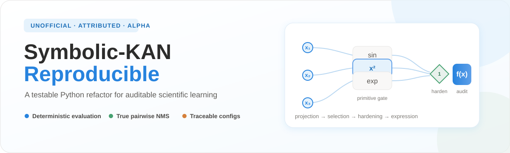

<p align="center">
  
</p>

<p align="center">
  <a href="https://github.com/jiangnan030-del/symbolic-kan-reproducible/actions/workflows/ci.yml"></a>
  
  <a href="LICENSE"></a>
  
</p>

<p align="center"><a href="README.md">English</a> · 简体中文</p>

> **非官方衍生版本——使用时必须保留归属。** 本仓库对公开的 Symbolic-KAN
> 研究代码进行 Python 包化和可复现性重构。Symbolic-KAN 方法、论文和原始实验归
> Salah A. Faroughi、Farinaz Mostajeran、Amirhossein Arzani、Shirko Faroughi
> 所有。本项目不是原作者的官方发布，也不代表原作者背书。

本项目提供可安装、可测试的 `symbolic_kan` Python 包，重点改善确定性验证、结构硬化、
实验配置、数值安全、测试和来源追踪。当前版本为研究软件 Alpha，不宣称已经复现论文全部表格和长训练结果。

## 原始来源

- 原论文：**Symbolic–KAN: Kolmogorov-Arnold networks with discrete symbolic structure for interpretable learning**
- 原作者：Salah A. Faroughi、Farinaz Mostajeran、Amirhossein Arzani、Shirko Faroughi
- 原仓库：https://github.com/sfaroughi3/Pub_Symbolic_KANs
- 审计基线：[`9481a82`](https://github.com/sfaroughi3/Pub_Symbolic_KANs/commit/9481a822e73e5a7520c6c0a425a8a402f2878c03)
- 许可证：原 Python 文件中的 MIT 许可声明

发表论文、报告或衍生代码时，必须引用原论文和原仓库，并把本仓库描述为非官方衍生实现。
详见 [`NOTICE.md`](NOTICE.md) 与 [`docs/ACADEMIC_INTEGRITY.md`](docs/ACADEMIC_INTEGRITY.md)。

## 主要改进

- 标准 `src/symbolic_kan` 包结构；
- 训练态 Gumbel-Softmax 与验证态确定性行为分离；
- AdamW 参数组显式应用配置的 weight decay；
- 真正的 pairwise NMS，并将旧 off-mass 项单独命名；
- `fixed_sum` 与 `trainable_linear` 两种 readout；
- primitive、edge 和可选 unit 的结构硬化；
- 安全逆函数和正参数约束；
- 针对每个变上限映射的 Volterra Gauss–Legendre 求积；
- `legacy`、`paper`、`corrected`、`smoke` 配置分离；
- pytest、CI、引用元数据和可复现性文档。

## 安装

支持 Python 3.10–3.12：

```bash
pip install "symbolic-kan-reproducible @ git+https://github.com/jiangnan030-del/symbolic-kan-reproducible.git"
```

开发安装：

```bash
python -m venv .venv
source .venv/bin/activate
pip install -e ".[dev,viz]"
```

## 快速开始

```python
import torch
from symbolic_kan import ModelConfig, SymbolicKAN, export_expression

config = ModelConfig(
    input_dim=1,
    hidden_units=4,
    edges_per_unit=2,
    num_blocks=2,
    primitives=("x", "x2", "sin", "cos", "exp"),
    readout="fixed_sum",
)

model = SymbolicKAN(config)
x = torch.linspace(-1, 1, 64).reshape(-1, 1)
model.eval()
prediction = model(x)
model.harden()
print(export_expression(model, variables=["x"]))
```

命令行检查：

```bash
symkan info
symkan smoke --config experiments/reaction_diffusion/configs/smoke.yaml
```

## 配置边界

- `legacy`：记录审计到的上游脚本行为；
- `paper`：采用论文中陈述、但与上传脚本不同的设置；
- `corrected`：启用本包的数值和可复现性修复；
- `smoke`：只用于安装与 CI 快速检查，不是科学基准。

`corrected` 结果不能表述为原作者结果；通过 `smoke` 也不等于完成论文复现。

## 当前状态

当前 Alpha 已覆盖确定性验证、结构硬化、primitive 数值安全、pairwise NMS、表达式导出、
优化器配置和 Volterra 求积测试。尚未独立复现论文全部随机种子、表格和长训练指标。
详见 [`docs/REPRODUCIBILITY.md`](docs/REPRODUCIBILITY.md) 与
[`docs/VALIDATION_STATUS.md`](docs/VALIDATION_STATUS.md)。

## 许可证与引用

项目采用 MIT 许可证。原始版权声明保留在 [`LICENSE`](LICENSE)，衍生关系与非背书说明见
[`NOTICE.md`](NOTICE.md)。结构化引用信息见 [`CITATION.cff`](CITATION.cff)。
