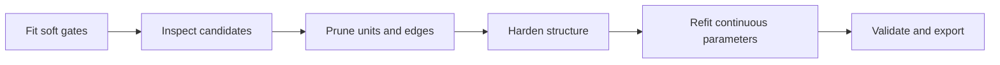

# Symbolic-KAN Reproducible

> **Unofficial derivative.** The Symbolic-KAN method, paper, and original experiments belong to Salah A. Faroughi, Farinaz Mostajeran, Amirhossein Arzani, and Shirko Faroughi. This documentation does not imply endorsement by the original authors.

This package turns the public research implementation into an installable, testable, configuration-driven Python project while keeping `legacy`, `paper`, `corrected`, and `smoke` results distinct.

## Discovery workflow

## Start here

- [Inspectability workflow](INSPECTABILITY.md)
- [Reproducibility protocol](REPRODUCIBILITY.md)
- [Validation status](VALIDATION_STATUS.md)
- [Paper/code differences](PAPER_CODE_DIFFERENCES.md)
- [Academic integrity](ACADEMIC_INTEGRITY.md)
- [Related work](RELATED_WORK.md)

## Provenance

- Upstream repository: <https://github.com/sfaroughi3/Pub_Symbolic_KANs>
- Audited upstream commit: `9481a822e73e5a7520c6c0a425a8a402f2878c03`
- Package status: unofficial derivative alpha
